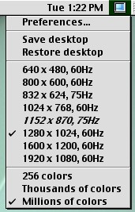

# retrotink-apple
RetroTink 4K Profiles for Apple Computers

## Custom Input Modes

Includes a set of custom inputs modes to allow these profiles to include settings for many different display modes that are already tuned and ready to go.

Apple Specific Timings:
- Macintosh 832x624
- Macintosh 1152x860 (Work in Progress)

Unusual Apple Timings:
- Macintosh UXGA (GeForce 2MX on MacOS 9)
- Macintosh 1080p (GeForce 2MX on MacOS 9)

## Included Profiles

### Quadra 605

Aimed at early machines that include an Apple DB-15 video port and a VGA adapter. Should work with many 68K machines, and even early PowerPC machines. Has only been tested with System 7 and MacOS 8.1.

Tuned for 640x480 @ 67Hz, 832x624 @ 75Hz and 1024x768 @ 75Hz.

### PowerMac Quicksilver G4

Aimed at later PowerMacs that have VGA video cards. Includes an array of tuned display modes out of the box. It is heavily recommended to use SwitchRes when using the RetroTink 4K like this.

